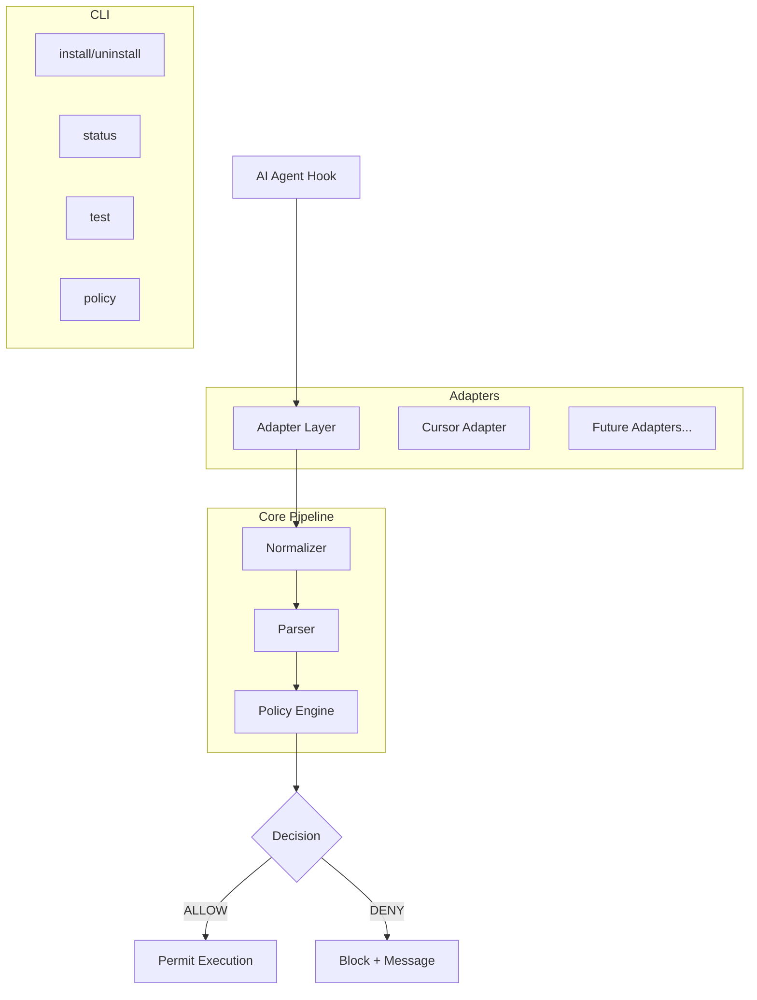

# Design Document: Mr. Nope

## Overview

Mr. Nope is a deterministic guardrail tool that prevents AI coding agents from executing forbidden operations. It operates as a lightweight interceptor between the AI agent and the system, evaluating commands against a YAML-based deny-list policy before they can execute.

The tool is implemented in Rust for minimal startup time, zero runtime dependencies, and cross-platform compilation. It integrates with AI coding agents via adapter plugins — starting with Cursor's hook system — and provides a CLI for installation, policy management, and self-testing.

**Key Design Decisions:**
- **Rust** as the implementation language for performance (sub-10ms evaluation, sub-50ms with process startup), small binary size, and native cross-compilation.
- **Deterministic evaluation** — no LLM, no network, no randomness. Same input always produces same output.
- **Fail-closed** — if policy is malformed or parsing fails, deny by default.
- **Pipeline architecture** — Normalizer → Parser → Policy Engine, each stage independently testable.

## Architecture



**Execution Flow:**

1. The AI agent triggers a hook (shell command or MCP tool call).
2. The adapter receives JSON on stdin from the agent's hook mechanism.
3. The adapter extracts the command string(s) to evaluate.
4. Each command string passes through: Normalizer → Parser → Policy Engine.
5. The adapter returns JSON on stdout with `permission: "allow"` or `permission: "deny"`.

**Data Flow for Shell Commands:**
```
Hook stdin (JSON) → Adapter → extract "command" field
  → Normalizer: URL-decode → whitespace-collapse → path-extract
  → Parser: split compounds → strip prefixes → extract substitutions → identify cmd+subcmd
  → Policy Engine: match against deny rules
  → Adapter → Hook stdout (JSON response)
```

**Data Flow for MCP Tool Calls:**
```
Hook stdin (JSON) → Adapter → extract all string values from "tool_input"
  → For each string value: run through Normalizer → Parser → Policy Engine
  → If ANY string triggers DENY → reject entire MCP call
  → Adapter → Hook stdout (JSON response)
```

## Components and Interfaces

### Core Trait: `PolicyEvaluator`

```rust
pub enum Decision {
    Allow,
    Deny { rule: DenyRule },
}

pub struct DenyRule {
    pub command: String,
    pub subcommands: Vec<String>,
}

pub struct EvaluationResult {
    pub decision: Decision,
    pub raw_input: String,
    pub normalized: String,
    pub parsed_commands: Vec<ParsedCommand>,
}

pub trait PolicyEvaluator {
    fn evaluate(&self, raw_command: &str) -> EvaluationResult;
}
```

### Normalizer

```rust
pub struct Normalizer;

impl Normalizer {
    /// Normalize a raw command string:
    /// 1. URL-decode (iterative, max 3 passes)
    /// 2. Collapse whitespace (multiple spaces/tabs → single space, trim)
    /// 3. Extract binary names from path-qualified references
    pub fn normalize(&self, input: &str) -> NormalizedOutput;
}

pub struct NormalizedOutput {
    pub text: String,
    pub decode_passes: u8,
}
```

### Parser

```rust
pub struct ParsedCommand {
    pub command: String,
    pub subcommand: Option<String>,
    pub full_segment: String,
}

pub struct Parser;

impl Parser {
    /// Parse a normalized command string into individual command segments.
    /// Handles: pipes, logical operators, semicolons, nested shells,
    /// command substitutions, prefix stripping, comment removal, quote awareness.
    pub fn parse(&self, normalized: &str) -> Result<Vec<ParsedCommand>, ParseError>;
}
```

### Policy Engine

```rust
pub struct PolicyEngine {
    rules: Vec<DenyRule>,
    is_default: bool,
}

impl PolicyEngine {
    /// Load from a YAML file path, falling back to built-in default policy.
    pub fn load(path: Option<&Path>) -> Result<Self, PolicyError>;

    /// Match a parsed command against deny rules.
    /// Returns Deny if command matches a rule's `command` AND the parsed subcommand
    /// is contained in the rule's `subcommands` array (case-sensitive exact match).
    pub fn match_command(&self, cmd: &ParsedCommand) -> Decision;
}

impl PolicyEvaluator for PolicyEngine {
    fn evaluate(&self, raw_command: &str) -> EvaluationResult;
}
```

### Adapter Trait

```rust
pub trait Adapter {
    /// Process a hook event from stdin JSON, return response JSON for stdout.
    fn handle_hook(&self, input: &HookInput) -> HookResponse;
}

pub struct HookInput {
    pub hook_event_name: String,
    pub command: Option<String>,
    pub tool_name: Option<String>,
    pub tool_input: Option<String>,
    pub workspace_roots: Vec<String>,
}

pub struct HookResponse {
    pub permission: Permission,
    pub user_message: Option<String>,
    pub agent_message: Option<String>,
}

pub enum Permission {
    Allow,
    Deny,
}
```

### Cursor Adapter

```rust
pub struct CursorAdapter {
    engine: PolicyEngine,
    normalizer: Normalizer,
    parser: Parser,
}

impl Adapter for CursorAdapter {
    fn handle_hook(&self, input: &HookInput) -> HookResponse;
}

impl CursorAdapter {
    /// Handle beforeShellExecution: evaluate the command field.
    fn handle_shell_execution(&self, command: &str) -> HookResponse;

    /// Handle beforeMCPExecution: scan all string values in tool_input.
    fn handle_mcp_execution(&self, tool_input: &str) -> HookResponse;
}
```

### CLI Module

```rust
pub enum CliCommand {
    Install { adapter: String, scope: InstallScope },
    Uninstall { adapter: String, scope: InstallScope },
    Status,
    Test,
    Policy,
}

pub enum InstallScope {
    Global,
    Project,
}
```

## Data Models

### Policy File Schema (YAML)

```yaml
# .mr-nope.yml
rules:
  - deny:
      command: "git"
      subcommands:
        - "commit"
        - "push"
```

**Validation Rules:**
- `rules` must be an array (can be empty for allow-all).
- Each entry must have a `deny` object.
- `deny.command` — required string, 1–128 characters, non-whitespace-only.
- `deny.subcommands` — required, non-empty array of strings, each entry 1–128 characters, non-whitespace-only.

### Default Policy (Built-in)

When no custom `.mr-nope.yml` exists at the expected location, the engine loads:

```yaml
rules:
  - deny:
      command: "git"
      subcommands:
        - "commit"
        - "push"
```

### Cursor Hook Configuration (`hooks.json`)

```json
{
  "version": 1,
  "hooks": {
    "beforeShellExecution": [
      {
        "command": "mr-nope evaluate"
      }
    ],
    "beforeMCPExecution": [
      {
        "command": "mr-nope evaluate"
      }
    ]
  }
}
```

**Hook locations:**
- Project-level: `<project>/.cursor/hooks.json`
- User-level (global): `~/.cursor/hooks.json` (macOS/Linux) or `%APPDATA%\Cursor\hooks.json` (Windows)

### Hook I/O Format

**Input (stdin):**
```json
{
  "conversation_id": "uuid",
  "generation_id": "uuid",
  "command": "git push origin main",
  "hook_event_name": "beforeShellExecution",
  "workspace_roots": ["/path/to/project"]
}
```

**Output (stdout) — Deny:**
```json
{
  "permission": "deny",
  "userMessage": "🚫 Mr. Nope blocked: git push (matched deny rule: git [commit, push]). Note: this protection applies only to AI agent execution via hooks, not to direct terminal usage.",
  "agentMessage": "Command 'git push' is blocked by Mr. Nope policy. This deny rule prevents git push operations. Do not attempt to bypass this restriction."
}
```

**Output (stdout) — Allow:**
```json
{
  "permission": "allow"
}
```

## Correctness Properties

*A property is a characteristic or behavior that should hold true across all valid executions of a system — essentially, a formal statement about what the system should do. Properties serve as the bridge between human-readable specifications and machine-verifiable correctness guarantees.*

### Property 1: Evaluation Determinism

*For any* command string and policy configuration, evaluating the same command N times (N ≥ 2) against the same policy SHALL always produce the same decision (ALLOW or DENY).

**Validates: Requirements 1.2**

### Property 2: Empty and Whitespace-Only Inputs Are Allowed

*For any* string composed entirely of whitespace characters (spaces, tabs, newlines) or the empty string, the Policy Engine SHALL return ALLOW.

**Validates: Requirements 1.5, 5.4**

### Property 3: Whitespace Normalization

*For any* command string containing arbitrary sequences of whitespace characters (spaces, tabs) between tokens, the Normalizer SHALL produce output where all inter-token whitespace is exactly one space and there is no leading or trailing whitespace.

**Validates: Requirements 2.1**

### Property 4: URL Decoding Round-Trip

*For any* ASCII string encoded with percent-encoding up to 3 levels deep, the Normalizer SHALL decode all percent-encoded sequences to produce the original character equivalents.

**Validates: Requirements 2.2, 2.3**

### Property 5: Path Extraction with Any Separator

*For any* path string using forward slashes, backslashes, or a mix of both, followed by a binary name, the Normalizer SHALL extract the final path segment as the base binary name.

**Validates: Requirements 2.5, 10.4**

### Property 6: Normalization Order Correctness

*For any* command string containing URL-encoded whitespace or path separators, the Normalizer SHALL produce the same result as applying URL-decode first, then whitespace-collapse, then path-extraction — and this result SHALL differ from incorrect orderings when the ordering matters.

**Validates: Requirements 2.6**

### Property 7: Compound Command Splitting

*For any* N commands (N ≥ 1) joined by pipes (`|`), logical operators (`&&`, `||`), or semicolons (`;`), the Parser SHALL extract all N commands as independent segments for evaluation.

**Validates: Requirements 3.1, 3.4**

### Property 8: Nested Shell Extraction

*For any* command wrapped in 1 to 3 levels of `sh -c`, `bash -c`, or `zsh -c` nesting, the Parser SHALL extract and evaluate the innermost command string.

**Validates: Requirements 3.2**

### Property 9: Builtin Prefix Stripping

*For any* command prefixed with `command`, `exec`, or `env`, the Parser SHALL strip the prefix and identify the actual command and subcommand for policy matching.

**Validates: Requirements 3.3**

### Property 10: Command and Subcommand Identification

*For any* command segment containing a binary name followed by flags (arguments starting with `-`) and positional arguments, the Parser SHALL identify the binary name as the command and the first non-flag argument as the subcommand.

**Validates: Requirements 3.5**

### Property 11: Command Substitution Extraction

*For any* command embedded within `$(...)` or backtick syntax, the Parser SHALL extract and include it in the set of commands evaluated against policy rules.

**Validates: Requirements 3.6, 9.4**

### Property 12: Policy Matching Correctness

*For any* parsed command, the Policy Engine SHALL return DENY if and only if the command name matches a deny rule's `command` field AND the parsed subcommand matches ANY entry in the rule's `subcommands` array (case-sensitive exact match). Otherwise it SHALL return ALLOW.

**Validates: Requirements 4.2, 4.3, 9.1**

### Property 13: Malformed Policy Denies All

*For any* invalid policy content (missing `rules` array, invalid YAML, missing required fields, empty/whitespace-only command, empty subcommands array, or any whitespace-only entry in subcommands), the Policy Engine SHALL deny all commands regardless of input.

**Validates: Requirements 4.4, 4.6**

### Property 14: Valid Policy Schema Acceptance

*For any* YAML document conforming to the policy schema (a `rules` array where each entry has a `deny` object with a `command` string of 1–128 non-whitespace-only characters and a `subcommands` non-empty array of strings each 1–128 non-whitespace-only characters), the Policy Engine SHALL load successfully and apply those rules.

**Validates: Requirements 4.5**

### Property 15: Adapter Response Correctness

*For any* command string, the Cursor Adapter SHALL return `permission: "deny"` with the matched rule information when the Policy Engine returns DENY, and `permission: "allow"` with the original command byte-for-byte unmodified when the Policy Engine returns ALLOW.

**Validates: Requirements 5.2, 5.3, 5.6**

### Property 16: Parse Error Results in Denial

*For any* input that causes the Normalizer or Parser to produce an error, the Cursor Adapter SHALL deny execution with an error message indicating the command could not be parsed.

**Validates: Requirements 5.5**

### Property 17: MCP Tool Call Scanning

*For any* MCP tool call with N string-valued input parameters, the Adapter SHALL deny the call if and only if at least one string parameter contains a command that matches a deny rule after normalization and parsing. If no parameter matches, the call SHALL be permitted with unmodified input data.

**Validates: Requirements 6.1, 6.2, 6.3**

### Property 18: Quoted Strings Not Treated as Commands

*For any* command where a forbidden command name appears only inside single-quoted or double-quoted string arguments (not in a command substitution context), the Parser SHALL NOT treat the quoted content as an executable command, and the Policy Engine SHALL return ALLOW for the overall command.

**Validates: Requirements 9.2**

### Property 19: Substring Matching Avoidance

*For any* command where a forbidden command name appears only as a substring within a larger token (e.g., filename, variable name), the Parser SHALL NOT match it as a command, and the Policy Engine SHALL return ALLOW.

**Validates: Requirements 9.3**

### Property 20: Comments Not Treated as Commands

*For any* shell command where a forbidden command name appears only after an unquoted `#` character (shell comment), the Parser SHALL NOT treat the commented text as an executable command, and the Policy Engine SHALL return ALLOW for the overall command.

**Validates: Requirements 9.5**

### Property 21: Custom Policy Fully Replaces Default

*For any* custom policy file present at the expected location, the Policy Engine SHALL use only the custom policy rules. Commands denied by the default policy but not by the custom policy SHALL return ALLOW.

**Validates: Requirements 14.2**

## Error Handling

### Error Categories

| Error Type | Trigger | Behavior |
|---|---|---|
| `PolicyLoadError` | YAML parse failure, missing required fields, empty/whitespace command, empty subcommands array, whitespace-only subcommand entries | Deny all operations, report specific error |
| `ParseError` | Unclosed quotes, malformed substitution syntax, nesting > 3 levels | Deny the specific command, report parse failure |
| `NormalizationError` | Invalid percent-encoding sequence (e.g., `%ZZ`) | Pass through as-is (best effort), do not error |
| `IOError` | Cannot read policy file (permissions, missing path) | Deny all operations, report file access error |
| `AdapterError` | Malformed JSON from hook stdin, missing required fields | Deny execution, report adapter input error |

### Fail-Closed Principle

The system always denies when uncertain:
- Malformed policy → deny all.
- Parse error → deny the command.
- Adapter cannot read input → deny.
- Unknown hook event → deny.

### Error Messages

Error messages follow a consistent format:
```
🚫 Mr. Nope: [ACTION] — [REASON]
```

Examples:
- `🚫 Mr. Nope: DENIED — matched rule: git [commit, push]`
- `🚫 Mr. Nope: DENIED — command could not be parsed for policy evaluation`
- `🚫 Mr. Nope: DENIED — policy file is malformed (missing 'rules' array)`

All denial messages append the transparency notice:
> This protection applies only to AI agent execution via hooks, not to direct terminal usage.

## Testing Strategy

### Property-Based Testing (proptest)

The core logic (Normalizer, Parser, Policy Engine) is highly amenable to property-based testing due to:
- Pure functions with clear input/output behavior.
- Large input space (arbitrary strings, command structures, encoding levels).
- Universal properties that should hold for all valid inputs.

**Library:** `proptest` (Rust)
**Configuration:** Minimum 100 iterations per property test.
**Tag format:** `// Feature: mr-nope, Property {N}: {property text}`

Each correctness property (1–21) maps to a single property-based test.

### Unit Tests (Example-Based)

Unit tests cover:
- Specific examples from requirements (e.g., `git status` → ALLOW, `git push` → DENY).
- Edge cases: 4+ encoding levels, maximum nesting depth, 128-character command/subcommand fields, subcommands arrays with many entries.
- Error conditions: malformed YAML, permission errors, empty tool_input JSON.
- Integration point examples: specific Cursor hook JSON payloads.

### Integration Tests

Integration tests cover:
- **CLI commands:** `install`, `uninstall`, `status`, `test`, `policy` with temporary directories.
- **End-to-end hook flow:** Pipe JSON to the binary stdin, verify stdout response.
- **Cross-platform paths:** Verify hook configuration writes to correct OS-specific locations.
- **Performance benchmarks:** Verify sub-10ms evaluation and sub-50ms startup.

### Test Organization

```
tests/
├── properties/          # Property-based tests (proptest)
│   ├── normalizer.rs    # Properties 3, 4, 5, 6
│   ├── parser.rs        # Properties 7, 8, 9, 10, 11, 18, 19, 20
│   ├── engine.rs        # Properties 1, 2, 12, 13, 14, 21
│   └── adapter.rs       # Properties 15, 16, 17
├── unit/                # Example-based unit tests
│   ├── normalizer.rs
│   ├── parser.rs
│   ├── engine.rs
│   └── adapter.rs
└── integration/         # End-to-end and CLI tests
    ├── cli.rs
    ├── hook_flow.rs
    └── performance.rs
```
